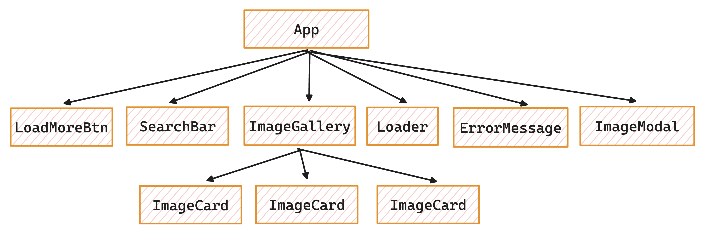

# Tier 4. Module 1: Mastering Front-End Development with React

## Topic 7 - React hooks (part 1)
## Topic 8 - React hooks (part 2)

## Homework

### Technical task - Image search

Write an image search application by keyword.

#### Image search service

In this task, you will use HTTP requests to retrieve images from the [Unsplash](https://unsplash.com/developers) image service.

* Register a developer account to get access to the documentation and the ability to interact with the backend.
* Create a record about your application on their service (New Application block). This is a mandatory step. Come up with a name for your app, like Image Gallery, Photo Search, or something similar.
* After creating a record about the application, on its page, get an access key for HTTP requests (Access Key) in the Keys section.

**Useful documentation sections:**

* [How to make a URL request](https://unsplash.com/documentation#schema)
* [How to add an access key to requests](https://unsplash.com/documentation#public-authentication)
* [Search images by keyword](https://unsplash.com/documentation#search-photos)

The response from the backend comes as an object with all the necessary information. There you will find an array of images and the total number of groups for pagination. Each image in the array is represented by an object with a large amount of information. First of all, you are interested in links to different size versions of the image in the urls property. Use the small version for the gallery cards, and the regular version for the modal window.

#### Components

In this task, you need to select the following components yourself and add basic interface styling to your liking.

#### Header with search form

The `SearchBar` component accepts one `onSubmit` prop - a function for passing the input value during form submission.

If the text field is empty when the submit button is clicked, show the user a notification that they need to enter text to search for images. This check is performed in the `SearchBar` component when the form is submitted. For notifications, use the [React Hot Toast](https://react-hot-toast.com/) library.

#### Image gallery

The `ImageGallery` component is a list of image cards that creates a DOM element.

The gallery should only render when there are any images loaded. It is good practice not to include the `li` element in the card component, but to leave it as part of the gallery component.

#### Image card

The `ImageCard` component renders in the gallery element.

#### Loading indicator

The `Loader` component is displayed below the gallery while images are being loaded. Use any ready-made component, for example, [react-loader-spinner](https://github.com/mhnpd/react-loader-spinner) or another.

While the images are loading, the loading indicator should not replace the gallery, but simply render below it. This will be critical when adding images to already uploaded ones.

#### Error message

Компонент `ErrorMessage` рендериться замість галереї зображень у випадку помилки HTTP-запиту. Достатньо, щоб це було текстове повідомлення.

#### Button to download additional images

The `LoadMoreBtn` component renders a button with the text "Load more". When the button is clicked, the next batch of images should be loaded and rendered together with the previous ones.

* The button should render only when there are any images loaded.
* If the image array is empty, the button is not rendered.

#### Modal window

The `ImageModal` component must render inside the `App` component and receive all necessary data and functions through props from the `App`.

When clicking on a gallery **image**, an `ImageModal` with a dark background should open and display the image in a large format. The modal window must be configured to close when you press the `ESC` key or when you click outside of it. To implement the functionality of the modal window, use the [React Modal](https://github.com/reactjs/react-modal?tab=readme-ov-file#examples) library.

### Acceptance criteria

* Main link: the assignment work page on [Vercel](https://vercel.com/).
* The project was created using [Vite](https://vitejs.dev/).
* When visiting the live task page, there are no errors or warnings in the console.
* For each component, there is a separate folder in the `src/components` folder that contains the JSX file of the React component itself and its styles file. The name of the folder, the component file (with the extension `.jsx`) and the style file (before `.module.css`) are the same and correspond to the names specified in the tasks (if there were any).
* The [axios](https://axios-http.com/) library is used to perform HTTP requests.
* The JS code is clean and clear, using Prettier.
* Styling is done by CSS modules.
